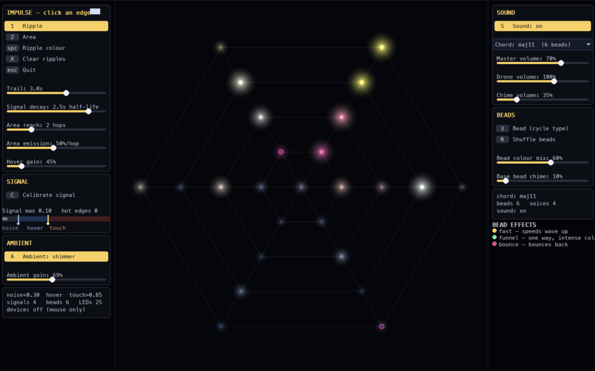

# Spider-web LED

A spider-web you can play like an instrument.



Touch a strand and a ripple of light runs across the web while a chime rings
out. Press harder and the ripple grows into a wave that spreads through the
whole structure. Beads scattered along the strands bend the light — some speed
it up, some funnel it, some bounce it back. Underneath, an ambient glow drifts
across the web, breathing, shimmering, or twinkling depending on the mood you
pick. A drone chord follows what you do; the more you play, the richer it gets.

Originally built as a workshop demo for a physical LED + capacitive-touch web,
this repo now bundles three ways to experience it:

- **Try it in your browser** — [live demo on GitHub Pages](https://mbanslow.github.io/ift-x-csl-web-lights-sounds/).
  No hardware, no install. Click and drag on the web.
- **Desktop app** — `python run.py dream`. The full reference experience with
  pygame + audio.
- **Installation mode** — `python run.py serve`. FastAPI backend that drives
  real SK6805/WS2812 LEDs over USB through an ESP32.

## What you can do

- **Ripples** — tap a strand, light and sound travel outward from the touch point.
- **Area effect** — a wider neighbourhood glows and rings together.
- **Beads** — cycle bead types on any node to shape how signals propagate.
- **Ambient modes** — shimmer, breathe, wander, twinkle, rainbow.
- **Sound** — drone + chime synthesis tied to the web state, with selectable
  chord qualities.

## Quick start (browser)

Just open the [live demo](https://mbanslow.github.io/ift-x-csl-web-lights-sounds/)
and click once anywhere to enable audio.

## Quick start (desktop)

```bash
python3.12 -m venv .venv
.venv/bin/pip install -r requirements.txt
.venv/bin/python run.py dream
```

Keys: `1` ripple · `2` area · `3` bead · `A` ambient · `S` sound · `Space` colour · `X` clear.

## Hardware

The desktop and installation modes can stream frames to an ESP32 running a thin
serial-to-LED bridge. Web geometry (nodes, strands, LED order) lives in
`config/web.json`. See `spiderweb/` for the engine, `docs/` for the browser
build, and `firmware/` for the ESP32 sketch.
